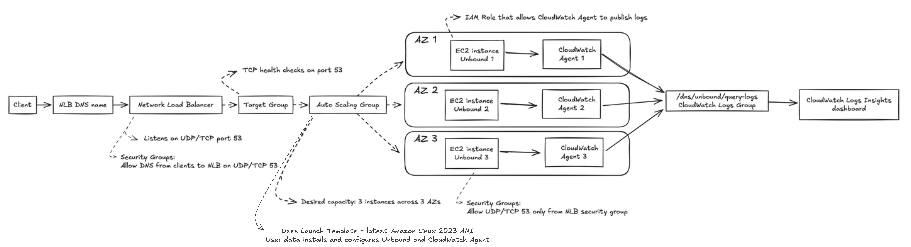

# Highly Available Recursive DNS on AWS with Unbound and Terraform

This repository provisions a highly available recursive DNS resolver on AWS with Terraform, [Unbound](https://www.nlnetlabs.nl/projects/unbound/about/), Amazon EC2, an Auto Scaling Group, a Network Load Balancer, and CloudWatch.

Clients query one stable Network Load Balancer DNS name. The NLB forwards UDP and TCP DNS traffic to healthy Unbound instances distributed across three Availability Zones. Each instance sends its query log to a shared CloudWatch Logs group, where Logs Insights queries power a small DNS analytics dashboard.

This is a learning project that demonstrates how networking, compute, availability, load balancing, logging, and observability fit together as code. It is not a production-ready public recursive resolver.

## Terraform follow-up to the original project

The original manually created project was made approximately four months before this repository was created.

The first version of this project was assembled manually in AWS and used a manually prepared Golden AMI. The original walkthrough documents that console-driven implementation:

[Building a Highly Available DNS Resolver on AWS with Unbound, Auto Scaling, NLB, and CloudWatch](https://lsblk.dev/posts/building-a-highly-available-dns-resolver-on-aws-with-unbound-auto-scaling-nlb-and-cloudwatch)

This repository is the reproducible Terraform follow-up. The implementation has the same overall service shape, but Terraform now manages the AWS resources and the Launch Template bootstraps each instance with user data. The current code does not build or consume the old Golden AMI.

The original blog post remains useful for the design background and the manually created version. The Terraform files in this repository are the source of truth for the implementation described below.

## What this repository creates

| Area | Current implementation |
| --- | --- |
| AWS Region | `eu-west-3` |
| Provider | AWS provider `6.63.0` |
| VPC | `10.0.0.0/16` with DNS hostnames and DNS support enabled |
| Network layout | Three public `/20` subnets, one in each of the first three available Availability Zones |
| Resolver fleet | Amazon Linux 2023 x86_64, `t3.micro`, desired capacity `3`, maximum capacity `6` |
| Client endpoint | Internet-facing Network Load Balancer |
| DNS transports | UDP and TCP on port `53` |
| Target health | TCP health checks on port `53` |
| Centralized logs | `/dns/unbound/query-logs`, retained for 14 days |
| Analytics | `DNS-Unbound-Analytics` CloudWatch dashboard with six Logs Insights widgets |

## Architecture



*The repository architecture diagram shows the client path through the NLB, target group, and Auto Scaling Group, plus the per-instance CloudWatch Agent path into the shared log group and dashboard.*

The request and logging paths are:

1. A client sends a DNS query to the NLB DNS name.
2. The internet-facing NLB accepts UDP or TCP traffic on port `53`.
3. The NLB forwards the query to an instance in the `unbound-dns-tg` target group.
4. The target group contains instances launched by the Auto Scaling Group.
5. A healthy EC2 instance runs Unbound and recursively resolves the query.
6. Unbound writes query logs to `/var/log/unbound/unbound.log`.
7. The CloudWatch Agent on that instance publishes the file to `/dns/unbound/query-logs`.
8. CloudWatch Logs Insights queries read the shared log group for the `DNS-Unbound-Analytics` dashboard.

The NLB DNS name is the service endpoint. Individual instance IP addresses are implementation details and should not be used by clients.

### Availability model

The Auto Scaling Group launches the desired three instances across the three public subnets. The NLB and target group provide the stable front door and health-aware routing:

- The NLB is deployed across all three public subnets.
- The target group registers instances created by the Auto Scaling Group.
- The target group checks that each instance is accepting TCP connections on port `53`.
- The Auto Scaling Group uses ELB health checks and replaces unhealthy instances.
- The ASG allows capacity from `3` through `6`, although this configuration does not define a CPU- or query-based scaling policy.
- The configured rolling instance refresh uses a `100%` minimum healthy percentage and a `180`-second instance warm-up.

This is regional high availability across three Availability Zones in `eu-west-3`. It is not a multi-region or globally anycast design.

## Terraform layout

| File | Responsibility |
| --- | --- |
| `provider.tf` | Pins the AWS provider and selects `eu-west-3`; reads the current region and available Availability Zones |
| `vpc.tf` | Creates the VPC, Internet Gateway, three public subnets, public route table, and subnet associations |
| `security_groups.tf` | Allows public DNS traffic to the NLB and allows only NLB-originated DNS traffic into the resolver instances |
| `compute.tf` | Selects the latest matching Amazon Linux 2023 x86_64 AMI and defines the Launch Template plus bootstrap script |
| `loadbalancer.tf` | Defines the TCP/UDP target group, TCP health checks, internet-facing NLB, listener, and Auto Scaling Group |
| `iam.tf` | Creates the EC2 role and instance profile used by the CloudWatch Agent |
| `cloudwatch.tf` | Creates the centralized Unbound query-log group with 14-day retention |
| `dashboard.tf` | Creates the six-widget CloudWatch Logs Insights dashboard |
| `outputs.tf` | Exposes the NLB DNS name, log-group name, and dashboard name |
| `architecture.png` | Architecture diagram for the deployed design |

## Networking

### VPC and subnets

The VPC uses CIDR `10.0.0.0/16`. Terraform derives three `/20` public subnets with `cidrsubnet` and places them in the first three Availability Zones returned by AWS.

Each subnet:

- has a route to the Internet Gateway through the shared public route table;
- maps public IPv4 addresses on launch; and
- is used by both the internet-facing NLB and the Auto Scaling Group.

This simple public-subnet layout keeps the lab easy to inspect and bootstrap. A hardened deployment should place resolver instances in private subnets and keep only the intended load-balancer path public.

### Security groups

The NLB security group currently:

- allows UDP port `53` from `0.0.0.0/0`;
- allows TCP port `53` from `0.0.0.0/0`; and
- allows all outbound traffic.

The EC2 resolver security group:

- accepts UDP port `53` only from the NLB security group;
- accepts TCP port `53` only from the NLB security group;
- allows outbound UDP and TCP port `53` for recursive DNS lookups; and
- allows outbound TCP port `443` so the CloudWatch Agent can reach AWS APIs.

The security groups are intentionally explicit about the traffic path from the NLB to the instances. They do not, however, make this an appropriately restricted public resolver: the NLB ingress rules are open to the internet, and the current Unbound configuration also contains a broad temporary allow rule.

## Resolver instances and bootstrap

### AMI and Launch Template

The Launch Template selects the most recent Amazon-owned Amazon Linux 2023 x86_64 HVM AMI matching:

```text
al2023-ami-2023.*-x86_64
```

It launches `t3.micro` instances with:

- the CloudWatch instance profile;
- the resolver security group;
- public IPv4 addressing; and
- the `unbound-dns-resolver` instance tag.

Unlike the original manual implementation, the current repository does not depend on a prebuilt Golden AMI. User data installs the required packages at boot:

```text
unbound
amazon-cloudwatch-agent
```

This keeps the repository self-contained and makes the infrastructure easier to recreate, but it also makes bootstrap time and package availability part of instance readiness.

### Bootstrap sequence

The Launch Template user-data script:

1. Updates the Amazon Linux package metadata and installs Unbound and the CloudWatch Agent.
2. Creates the Unbound configuration and log directories.
3. Writes `/etc/unbound/unbound.conf`.
4. Writes the CloudWatch Agent configuration.
5. Runs `unbound-checkconf`.
6. Enables and restarts Unbound.
7. Confirms that Unbound is active.
8. Starts the CloudWatch Agent with the generated configuration.

If the Unbound restart fails, the script prints the service status and recent journal entries before exiting with a failure. That makes the EC2 console output useful when a target never becomes healthy.

### Effective Unbound configuration

The configuration embedded in `compute.tf` is intentionally small and project-oriented:

```conf
server:
    chroot: ""
    directory: "/var/lib/unbound"
    username: "unbound"

    port: 53
    interface: 0.0.0.0
    do-ip4: yes
    do-ip6: no

    access-control: 127.0.0.0/8 allow
    access-control: 10.0.0.0/16 allow
    access-control: 0.0.0.0/0 allow

    hide-identity: yes
    hide-version: yes
    harden-glue: yes
    harden-dnssec-stripped: yes
    use-caps-for-id: yes

    prefetch: yes
    cache-min-ttl: 60
    cache-max-ttl: 86400
    msg-cache-size: 64m
    rrset-cache-size: 128m

    unwanted-reply-threshold: 10000

    verbosity: 1
    log-queries: yes
    log-replies: no
    log-servfail: yes
    log-time-ascii: yes
    use-syslog: no
    logfile: "/var/log/unbound/unbound.log"
```

Important behavior:

- Unbound listens on all IPv4 interfaces because the ASG creates instances with changing addresses.
- IPv6 listening is disabled in this project.
- The VPC CIDR is allowed for internal access.
- Query logging and SERVFAIL logging are enabled.
- Response logging is disabled to reduce noise and log volume.
- The empty `chroot` setting keeps the absolute log path usable.
- The `0.0.0.0/0 allow` rule is a temporary testing shortcut and must be replaced with an explicit client allowlist before any serious deployment.

Listening on `0.0.0.0` is not itself an authorization policy. The intended access boundary comes from the security groups, routing, and Unbound `access-control` rules together.

## Load balancing and health

The target group is named `unbound-dns-tg` and uses:

- target type `instance`;
- port `53`;
- protocol `TCP_UDP`; and
- TCP health checks on port `53`.

The health check thresholds are two consecutive successes or failures, with a 10-second interval and a 5-second timeout. DNS queries can use UDP or TCP, but the health check intentionally uses TCP as a simple test that the resolver is listening on the DNS port.

The NLB:

- is internet-facing;
- spans the three public subnets;
- uses the NLB security group; and
- exposes one `TCP_UDP` listener on port `53` that forwards to the target group.

The Auto Scaling Group connects directly to the target group, so instances are registered when they launch and deregistered when they are removed. It uses the latest Launch Template version, ELB health checks, a 180-second health-check grace period, and a rolling refresh configuration.

## Logging and observability

### CloudWatch Agent

Each instance sends `/var/log/unbound/unbound.log` to:

```text
/dns/unbound/query-logs
```

The stream name is the EC2 instance ID. This keeps logs distinguishable across the resolver fleet and preserves each instance's stream after that instance is replaced.

The CloudWatch Agent uses the EC2 instance profile created in `iam.tf`. That profile attaches the AWS-managed `CloudWatchAgentServerPolicy`. The log group itself is created by Terraform before the Auto Scaling Group is allowed to start instances.

The log group retention is 14 days. Retention is part of the cost and privacy design: DNS query logs can reveal user activity, application dependencies, infrastructure names, and security-relevant behavior.

### Dashboard

`dashboard.tf` creates a CloudWatch dashboard named `DNS-Unbound-Analytics` with six Logs Insights widgets:

1. Top queried domains
2. Top querying clients
3. DNS query volume over time
4. Query-type distribution
5. Top queried TLDs
6. Suspiciously long TXT queries

The dashboard parses the Unbound query-log shape for the client address, domain, and query type. The queries are intended for visibility and learning, not for a complete DNS security-detection system.

#### Top queried domains

```sql
SOURCE '/dns/unbound/query-logs'
| fields @timestamp, @message
| parse @message /info:\s+(?<client_ip>[^\s]+)\s+(?<domain>[^\s]+)\s+(?<query_type>[^\s]+)/
| stats count(*) as query_count by domain
| sort query_count desc
| limit 15
```

#### Top querying clients

```sql
SOURCE '/dns/unbound/query-logs'
| fields @timestamp, @message
| parse @message /info:\s+(?<client_ip>[^\s]+)\s+(?<domain>[^\s]+)\s+(?<query_type>[^\s]+)/
| stats count(*) as query_count by client_ip
| sort query_count desc
| limit 15
```

#### Query volume over time

```sql
SOURCE '/dns/unbound/query-logs'
| fields @timestamp, @message
| filter @message like /info:/
| stats count(*) as queries by bin(1m)
```

#### Query types

```sql
SOURCE '/dns/unbound/query-logs'
| fields @timestamp, @message
| parse @message /info:\s+(?<client_ip>[^\s]+)\s+(?<domain>[^\s]+)\s+(?<query_type>[^\s]+)/
| stats count(*) as total by query_type
| sort total desc
```

#### Top-level domains

```sql
SOURCE '/dns/unbound/query-logs'
| fields @timestamp, @message
| parse @message /info:\s+(?<client_ip>[^\s]+)\s+(?<domain>[^\s]+)\s+(?<query_type>[^\s]+)/
| parse domain /.*\.(?<tld>[^\.\]+\.?)$/
| stats count(*) as count by tld
| sort count desc
| limit 10
```

#### Long TXT queries

```sql
SOURCE '/dns/unbound/query-logs'
| fields @timestamp, @message
| parse @message /info:\s+(?<client_ip>[^\s]+)\s+(?<domain>[^\s]+)\s+(?<query_type>[^\s]+)/
| filter query_type = "TXT"
| filter strlen(domain) > 40
| stats count(*) as occurrences by client_ip, domain
| sort occurrences desc
```

Long TXT queries can be completely legitimate, for example during verification flows or service integrations. They are included as a useful investigation signal, not as proof of malicious activity.

## Prerequisites

Before deploying, have:

- an AWS account with permission to create the resources in this repository;
- Terraform installed and compatible with the AWS provider version pinned in `provider.tf`;
- the AWS CLI installed and authenticated;
- network access from the Terraform host to AWS APIs; and
- at least three available Availability Zones in `eu-west-3`.

Do not put access keys, secret keys, session tokens, or other credentials in Terraform files, `terraform.tfvars`, this README, or the repository. Prefer an AWS profile, IAM Identity Center, or temporary credentials.

For an AWS IAM Identity Center profile:

```bash
aws sso login --profile <profile-name>
export AWS_PROFILE=<profile-name>
aws sts get-caller-identity --region eu-west-3
```

The identity command should succeed before Terraform is run. It verifies the selected account and role without printing credential values.

## Deploy

Run the commands from this repository directory:

```bash
terraform init
terraform fmt -check
terraform validate
terraform plan
terraform apply
```

Review the plan carefully before approving `terraform apply`. The apply creates:

- the VPC, Internet Gateway, route table, and three public subnets;
- the NLB and its security group;
- the DNS target group and listener;
- the Launch Template and EC2 instance profile;
- the Auto Scaling Group and three initial resolver instances;
- the CloudWatch log group; and
- the CloudWatch dashboard.

`terraform init` creates the local `.terraform` directory and may create or update the provider lock file. Keep Terraform state and generated plan files protected; state can contain infrastructure details that should not be public.

## Outputs

After a successful apply:

```bash
terraform output

dns_endpoint="$(terraform output -raw nlb_dns_name)"
log_group="$(terraform output -raw cloudwatch_log_group)"
dashboard="$(terraform output -raw dashboard_name)"
```

The outputs are:

| Output | Meaning |
| --- | --- |
| `nlb_dns_name` | Stable public DNS endpoint for client queries |
| `cloudwatch_log_group` | Centralized log group receiving Unbound query logs |
| `dashboard_name` | Name of the provisioned CloudWatch dashboard |

The NLB DNS name is the endpoint to use with `dig`. Do not substitute the public IP address of an individual resolver instance.

## Verify the deployment

Allow time for the instances to finish package installation, configuration validation, and service startup before treating an initial health-check failure as a permanent problem.

### 1. Resolve the NLB hostname

```bash
dns_endpoint="$(terraform output -raw nlb_dns_name)"
dig +short "$dns_endpoint"
```

This verifies that the NLB hostname resolves. It does not yet prove that Unbound behind the NLB is answering recursive queries.

### 2. Test UDP and TCP DNS

```bash
dig "@$dns_endpoint" example.com A +time=3 +tries=1
dig "@$dns_endpoint" example.com A +tcp +time=3 +tries=1
```

A successful response should normally include `status: NOERROR`, the `rd` and `ra` flags, and an `ANSWER SECTION`. Test more than one record type if you want to exercise additional paths:

```bash
dig "@$dns_endpoint" cloudflare.com AAAA +time=3 +tries=1
dig "@$dns_endpoint" example.com TXT +time=3 +tries=1
dig "@$dns_endpoint" nonexistent-name.example A +time=3 +tries=1
```

The last query is useful for observing a negative response; its exact status and authority section depend on the upstream DNS response.

### 3. Check target health

Get the target group ARN:

```bash
target_group_arn="$(aws elbv2 describe-target-groups --names unbound-dns-tg --region eu-west-3 --query 'TargetGroups[0].TargetGroupArn' --output text)"
```

Inspect the registered instances:

```bash
aws elbv2 describe-target-health --target-group-arn "$target_group_arn" --region eu-west-3 --query 'TargetHealthDescriptions[].{Target:Target.Id,State:TargetHealth.State,Reason:TargetHealth.Reason}' --output table
```

Healthy targets should show `State` as `healthy`. During bootstrap or an instance refresh, `initial` and `draining` can appear temporarily. `unhealthy` with `Target.FailedHealthChecks` means the target is not accepting the TCP health check on port `53`.

### 4. Inspect centralized logs

Tail recent log events:

```bash
aws logs tail /dns/unbound/query-logs --since 10m --follow --region eu-west-3
```

Generate a test query while the tail is running:

```bash
dig "@$dns_endpoint" example.org A +time=3 +tries=1
```

The event should eventually appear in the shared log group. Each instance publishes to its own EC2-instance-ID stream.

### 5. Open or inspect the dashboard

The dashboard name is available as a Terraform output:

```bash
terraform output -raw dashboard_name
```

Open the `DNS-Unbound-Analytics` dashboard in the CloudWatch console in `eu-west-3`. The widgets need query-log events before they display useful data.

## Updating the resolver

The ASG launch template references `aws_launch_template.resolver_lt.latest_version`. Changes to the bootstrap script or Launch Template settings therefore become part of the next Launch Template version managed by Terraform.

For an update:

```bash
terraform fmt -check
terraform validate
terraform plan
terraform apply
```

Review the plan for both the Launch Template and Auto Scaling Group. The ASG contains a rolling instance-refresh configuration with:

- strategy `Rolling`;
- minimum healthy percentage `100`;
- instance warm-up `180` seconds; and
- `create_before_destroy` lifecycle behavior on the relevant resources.

After an update, check target health, ASG activity, and DNS responses. A successful Terraform apply alone is not runtime proof that every replacement instance completed bootstrap and became healthy.

## Troubleshooting

### Targets remain unhealthy

Check the target state and reason:

```bash
aws elbv2 describe-target-health --target-group-arn "$target_group_arn" --region eu-west-3 --output table
```

Then check the Auto Scaling Group and instance state:

```bash
aws autoscaling describe-auto-scaling-groups --auto-scaling-group-names <asg-name> --region eu-west-3
aws autoscaling describe-scaling-activities --auto-scaling-group-name <asg-name> --region eu-west-3 --max-items 20
```

Common causes include:

- the user-data script is still installing packages;
- Unbound failed `unbound-checkconf`;
- Unbound did not start or is not listening on port `53`;
- the EC2 security group does not allow traffic from the NLB security group; or
- the selected AMI cannot reach package repositories or AWS APIs during bootstrap.

The bootstrap script prints Unbound status and recent journal entries when the service restart fails. Use EC2 console output for the affected instance if you need to inspect those messages without changing the infrastructure.

### DNS queries time out

Confirm all of the following:

1. The client is querying the NLB DNS name.
2. The NLB security group permits UDP or TCP port `53` from the client network.
3. The target group contains healthy instances.
4. The EC2 security group permits DNS from the NLB security group.
5. Unbound is active and listening on `0.0.0.0:53`.
6. The instances can make outbound recursive DNS traffic on UDP/TCP port `53`.

The UDP and TCP smoke tests should be run separately because a successful TCP test does not prove that the UDP listener path is working.

### Logs are missing

Check:

- the CloudWatch log group name is exactly `/dns/unbound/query-logs`;
- the instance profile is attached to the instance;
- the CloudWatch Agent completed its `fetch-config` command;
- the instance can reach AWS APIs over HTTPS; and
- the Unbound logfile contains events at `/var/log/unbound/unbound.log`.

The IAM role uses the AWS-managed `CloudWatchAgentServerPolicy`. For a production design, review that broad managed policy and replace it with a narrower purpose-built policy if appropriate.

### Terraform cannot reach AWS

Verify the active identity:

```bash
aws sts get-caller-identity --region eu-west-3
```

If this succeeds but Terraform fails to connect to an AWS endpoint, inspect local DNS filtering, proxy variables, firewall rules, and IPv6 routing. A resource-creation retry or a destroy/recreate does not fix a network path problem on the Terraform host.

## Security and production limitations

I built this configuration to keep the learning path readable and the system observable, not to present it as production-hardened. Before I expose a resolver like this to real clients, I would need to address at least these points:

- I currently expose the NLB to the internet and allow TCP/UDP port `53` from `0.0.0.0/0`.
- I place the EC2 instances in public subnets and give them public IP addresses.
- I currently leave Unbound configured with `access-control: 0.0.0.0/0 allow`.
- I use the AWS-managed `CloudWatchAgentServerPolicy` for the instance role.
- I have not added CloudWatch alarms for SERVFAIL spikes, target health, traffic anomalies, or cost.
- I have not added an autoscaling policy tied to CPU, request volume, or another resolver metric.
- I designed this as a regional configuration, so it does not provide multi-region failover or Global Accelerator Anycast IPs.
- I send DNS query logs to CloudWatch, and those logs may contain sensitive information and create non-trivial ingestion and storage costs.
- I select the AMI dynamically and install packages at boot, so reproducibility depends on the selected AMI and the current package repositories.
- I still need to review and test DNSSEC validation, resolver policy, and upstream behavior for the intended environment.

To make this design stronger, I would:

1. Move the EC2 instances to private subnets with no public IPs.
2. Restrict NLB ingress to known client CIDRs or a private connectivity path.
3. Replace the broad Unbound rule with an explicit allowlist.
4. Use a least-privilege instance policy for log delivery.
5. Add alarms, dashboards for health and error rates, and a cost budget.
6. Build and test an immutable AMI with Packer or EC2 Image Builder.
7. Separate Terraform state into a protected remote backend.
8. Evaluate Route 53, Global Accelerator, or a multi-region resolver design where the requirements justify it.

## Cleanup

To remove the resources managed by this Terraform state:

```bash
terraform destroy
```

Review the destroy plan carefully. Only run this when the state belongs exclusively to this learning project. The command removes the AWS resources managed here, including the VPC, resolver instances, NLB, log group, and dashboard.

## Takeaways

The Terraform version makes the system reproducible and makes each operational boundary visible:

- `vpc.tf` defines the network and its three Availability Zones.
- `compute.tf` defines how a resolver instance is bootstrapped.
- `loadbalancer.tf` defines the stable endpoint, target health, and replacement fleet.
- `security_groups.tf` defines the intended network traffic path.
- Unbound owns recursive DNS behavior and query logging.
- The CloudWatch Agent centralizes logs from replaceable instances.
- `dashboard.tf` turns those logs into basic DNS traffic analytics.

The original manually created project showed how the pieces could be assembled in AWS. This repository turns that design into reviewable, repeatable Terraform while keeping the same learning focus.
